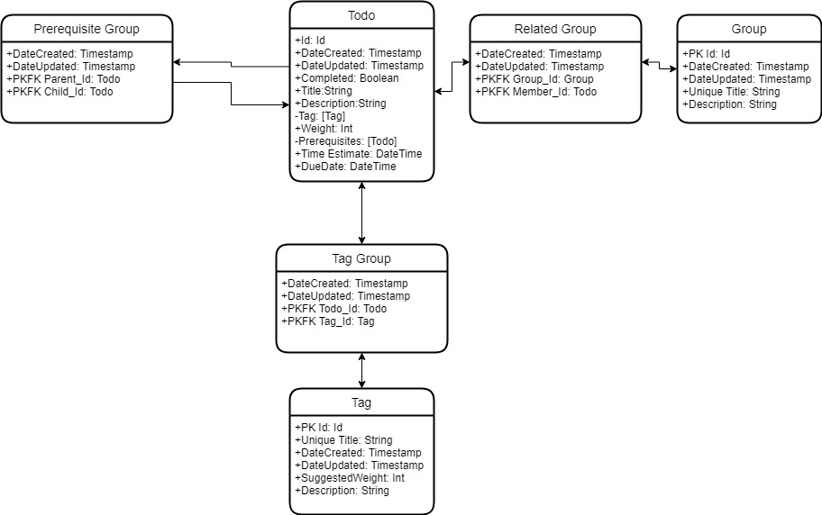
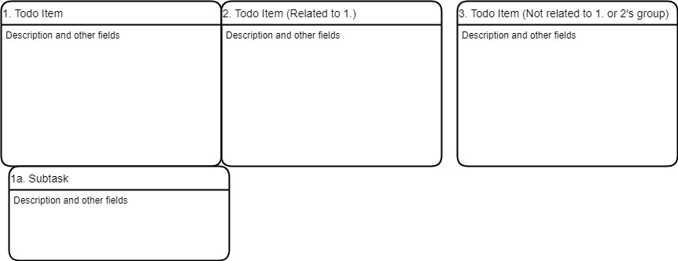
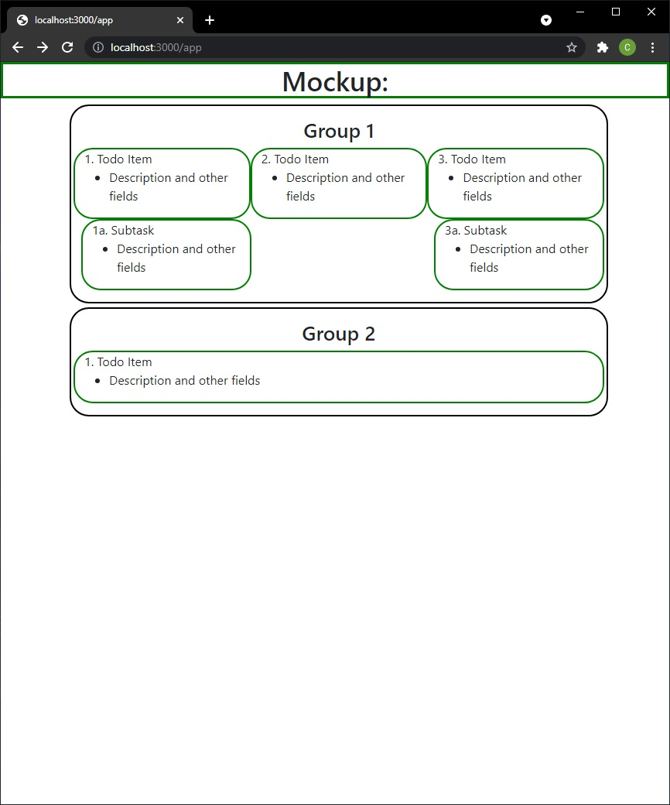

# Simple Todo Webapp
A program that stores, relates, and displays todo entities via a web application in order to help users better manage and keep track of their time. Currently runs on http://localhost:3000/

## Entities
* Todos
    * hold relevant information or actionable information
* Groups
    * Group together Todos for a common purpose or reasoning as specified by the user
    * More flexible and transient than tags
* Tags
    * Tags that help catagorize Todos and Groups
    * Intended to be an essential part of organizing Todos

## Goals for a Minimum Viable Product
* Information entry should be streamlined, allowing the user to quickly enter their desired information.
* A system for sorting and displaying todo items
    * by tag
    * by prerequisites
    * by related
    * as chosen by a user via a search interface
    * by weight
    * by urgent
    * by date (created, due, etc)
* I was originally inspired to make this program because I noticed that once I stopped using paper-based daily planners, I found it harder to keep track of my priorities, deadlines, and recent relevant information.
    * As a result, I wanted try designing a paperless, streamlined application that prompted me to fill out relevant information as necessary.
    * Theoretically, this would allow for both mindful processing of dense tasks and information and quick input for simpler tasks.
* Views
    * An hourly log view, saved on a daily basis in a format that can be recorded and analyzed
    * A freeform scratch space view, displaying as many related or selected todo items on a single page, sorted by user specification, and highly customizeable
        * allows users to make todos and add relationships to them in the same view
        * Add new or existing todos to groups
    * Tags will be suggested as the user fills in a field
    * Query for todos vs loading them all for inspection
    * Users can only ever work on one entity at a time, and will receive non-blocking success or failure popups after clearing the fields, when a response from the server is recieved
* Database
    * sqlite3 for lightweight storage within the container
    * Organized, with logical schema
    * Flexible and adaptable as the application's function grows

## Stretch Goals
* incorporate a synchronized stopwatch into the log portion
* log in and log out of an account to preserve items
* a mobile app to create events and store them in the same database
* Data stored primarily on a server running mysql to be accessed anywhere
* Todos can be minimized to just title, or maximized to show all info
* Use lazy loading in cases where large or complex todos/information is needed

## Mockups and Models

## Note about browser compatibility
This webapp uses javascript features that are not compatible with any Internet Explorer or Samsung Internet web browsers.